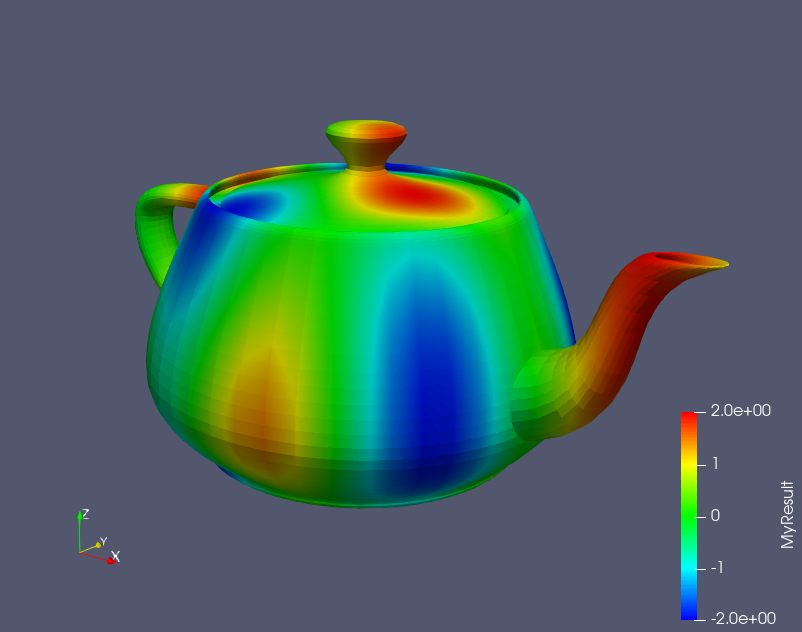

*It's not rust, it's a layer of seasoning!*

# Skillet

Skillet is a lightweight, deep-fried, rust application for interactive scientific visualization with [vtkio](https://github.com/elrnv/vtkio) and [glium](https://github.com/glium/glium).

Compare skillet with [ParaView](https://www.paraview.org/):

| Skillet                     | ParaView               |
| -----------                 | -----------            |
|  |  |

# Run

Provide the `.vtu` filename as an argument:

    cargo run ./res/teapot.vtu

You can try one of the provided `.vtu` files in the `./res/` directory.

Equivalently:

    cargo build
    # or "cargo build --release"
    
    ./target/debug/skillet.exe ./res/teapot.vtu
    
    # or "./target/release/skillet.exe ./res/teapot.vtu"

<!-- --------------------------------------------------------------- -->

## Mouse controls

Mouse controls mostly follow the ParaView conventions.

### LMB drag:  rotate

LMB means "left mouse button".

### Mouse wheel scroll:  zoom

### MMB drag:  pan

### RMB vertical drag:  z pan

Z pan is similar to scroll zooming.

<!-- --------------------------------------------------------------- -->

## Key controls

### `c`: cycle vector/tensor component

### `d`: cycle point data or cell data array

### `e`: toggle edge visibility

<!-- --------------------------------------------------------------- -->

# Features

## Data array types

| Data array        | Skillet support?   |
| -----------       | -----------        |
| Point data        |  ✔               |
| Cell data         |  ✔               |
| Scalars           |  ✔               |
| Vectors           |  ✔               |
| Tensors           |  ✔               |
| Generic           |  ✔               |
| Field attributes  |  ❌               |

## Cell types

Skillet displays color contours on surfaces.  As such, it doesn't make sense to
try to display 0D or 1D cells like `VTK_VERTEX` or `VTK_LINE`.  I might
implement types like triangle strips and quadratic cells if I can get some test
data.

| Cell            | Skillet support?   |
| -----------     | -----------        |
| Triangle        |  ✔               |
| Quad            |  ✔               |
| Tetra           |  ✔               |
| Hexahedron      |  ✔               |
| Wedge           |  ✔               |
| Pyramid         |  ✔               |
| Vertex cells    |  ❌               |
| Line cells      |  ❌               |
| Triangle strip  |  ❌               |
| Polygon         |  ❌               |
| Pixel           |  ❌               |
| Voxel           |  ❌               |
| Quadratic cells |  ❌               |

## File formats

Only binary/ascii `.vtu` files are supported.  Most formats can be converted to `.vtu` in ParaView like this:

1.  Filters -> alphabetical -> append dataset -> apply
2.  File -> save data -> VTK UnstructuredGrid files (\*.vtu) -> OK -> data mode binary or
    ascii

| File                | Extension | Skillet support?   |
| -----------         | --------- | -----------        |
| Unstructured grid   | `.vtu`    |  ✔               |
| Image data          | `.vti`    |  ❌               |
| Poly data           | `.vtp`    |  ❌               |
| Rectilinear grid    | `.vtr`    |  ❌               |
| Structured grid     | `.vts`    |  ❌               |
| Parallel files      | `.*pv*`   |  ❌               |
| Legacy files        | `.vtk`    |  ❌               |
| Multiple piece data | `.*`      |  ❌               |

| Data mode | Skillet support? |
| --------- | ---------------- |
| Ascii     |  ✔             |
| Binary    |  ✔             |
| Appended  |  ❌             |

## Operating systems

| OS            | Skillet support?   |
| -----------   | -----------        |
| Windows       |  ✔               |
| Ubuntu        |  ❌               |

On Ubuntu, the glutin dependency has an issue finding the fontconfig package.
Your mileage may vary:  https://unix.stackexchange.com/questions/330068/package-fontconfig-not-found-despite-having-installed-libfontconfig1-dev

